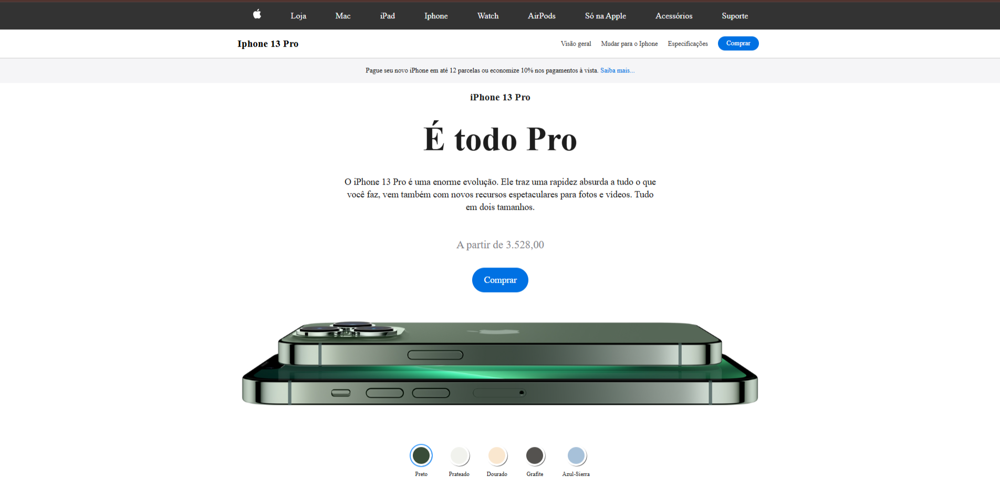

# Projeto - Página de Produto iPhone 13 Pro

Este projeto é uma página de produto inspirada no site oficial da Apple, focada na exibição do iPhone 13 Pro. Ele foi desenvolvido utilizando **HTML5**, **CSS3** e **JavaScript** puro, com responsividade e interatividade.

---

## 🔍 Visão Geral

A página apresenta o modelo iPhone 13 Pro com uma interface moderna, minimalista e funcional. Conta com:
- Um **menu de navegação** no topo.
- Seção de **informações principais** sobre o produto.
- Botão de compra destacado.
- **Seleção de cores** com troca dinâmica da imagem do produto.
- Estilo responsivo para **dispositivos móveis**.

---

## 🧪 Tecnologias Utilizadas

- **HTML5** – Estrutura da página
- **CSS3** – Estilização, responsividade e efeitos visuais
- **JavaScript** – Interatividade da troca de imagens por cor

---

## 🎨 Funcionalidades

- Troca de imagem do iPhone de acordo com a **cor selecionada**.
- Efeito de transição ao trocar a imagem (`.changing` class).
- Botões e navegação interativa com **estilo e destaque**.
- Layout adaptado para **telas pequenas** (modo responsivo).

---

## 📱 Responsividade

O layout foi adaptado para funcionar bem em dispositivos com telas de até **480px** de largura:
- Ocultação dos itens do menu
- Redução de tamanhos de fontes e imagens
- Foco em usabilidade mobile

---

## 🛠️ Como Usar

1. Clone ou baixe este repositório
2. Abra o arquivo `index.html` em seu navegador
3. Navegue pela interface e teste as interações com os botões de cor

---

## 💡 Aprendizados

Esse projeto ajudou a reforçar conceitos de:
- Manipulação de DOM com JavaScript
- Criação de layout responsivo com Flexbox
- Uso de `classList`, `setAttribute` e eventos de clique
- Boas práticas em estrutura de código e organização de pastas

---

## 📸 Imagens do Projeto

---

## 📌 Autor

Desenvolvido por **Luan Oliveira Dantas**  
💼 [LinkedIn](https://www.linkedin.com/in/luan-dantas-553407272/)   
📧 Email: luan.o.dantas@gmail.com

---

## ⚠️ Observações

Este projeto é apenas para fins de aprendizado e não representa uma cópia oficial da Apple.

